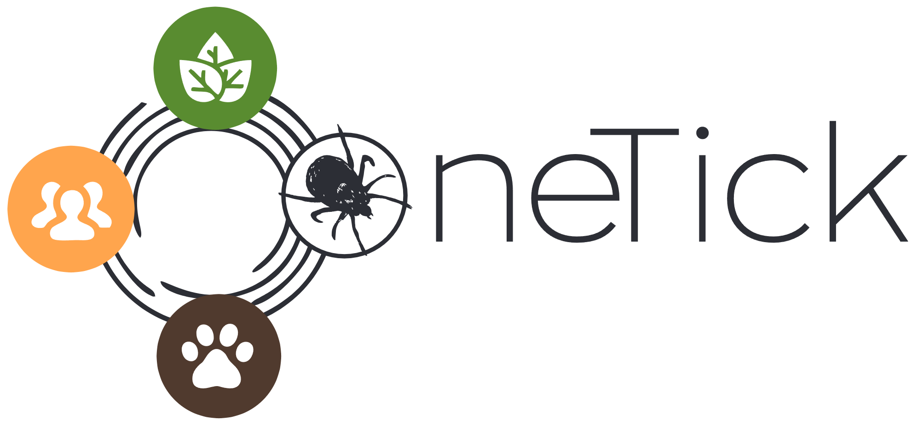

# OneTick

Preventing, detecting and treating tick-borne diseases in urban environments.

## 🧬 OneTick: One Health approach to tick‑borne diseases

**OneTick: An Integrated One Health Approach for Prevention, Detection and Treatment of Tick‑Borne Diseases in Urban and Peri‑Urban Environments**

**PI**: Michał  
**Proposal development**: Michał, Jarek, Valen  
**Funding agency**: European Commission \| European Research Executive Agency  
**Programme**: Horizon Europe \| Marie Skłodowska Curie Actions (MSCA) Staff Exchanges  
**Grant ID**: 101236599  
**Start date**: 1 Jan 2026  
**Duration**: 48 months  
**Budget**: €450,900.00  
**Grant agreement ID**: 101236599  
**CORDIS - EU research results**: <https://cordis.europa.eu/project/id/101236599>  
**doi**: [10.3030/101236599](https://doi.org/10.3030/101236599)

Tick‑borne diseases (TBDs) such as Lyme disease and TBE are on the rise in Europe due to shifts in climate and urbanization. In 2022, some 24% of Europeans resided in high‑risk Lyme areas, and the ECDC estimated ~360,000 cases in 2016, costing about €280M annually. OneTick advances prevention, detection and treatment within a One Health framework, targeting urban and peri‑urban areas.

### 📌 Project highlights

- 🔬 **WP1**: Urban tick ecology — assess abundance, diversity, and pathogens  
- 📈 **WP2**: Tick–host–pathogen modeling — predictive frameworks for disease spread  
- 🧪 **WP3**: Biomarker discovery & diagnostic modeling  
- 📣 **WP4**: Public outreach — guidelines and educational campaigns  
- 👥 **Secondments**: 90 PM (60 intersectoral, 30 interdisciplinary) to share best practices

Visit project website for full info. Click on the logo below.

