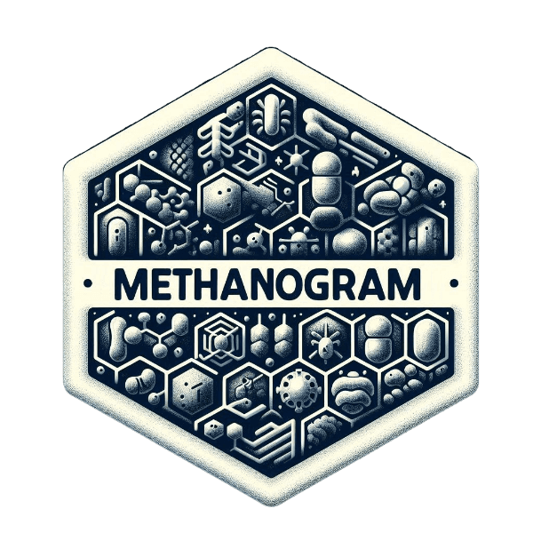
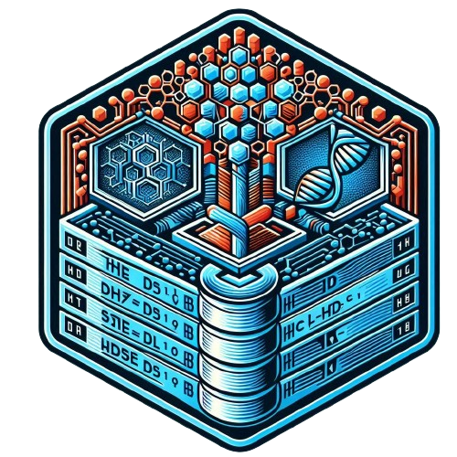

# Software

##  **Web servers**

**MetaboCrates** - tool for BioCrates kits data processing

**imputomics** - missing data imputation tool

**AMPBenchmark** - benchmarking of models for antimicrobial (AMP) peptide prediction

**HaDeX** - HDX-MS data processing tool

**countfitteR** - count data processing tool

**AmyloGram** - amyloid properties predictor

**AmpGram** - antimicrobial (AMP) peptide predictor

**PlastoGram** - subchloroplast localisation predictor

**CancerGram** - anticancer peptide predictor

**MethanoGram** - methanogens culture conditions predictor

##  **Databases**

**AmyloGraph** - amyloid-amyloid interaction database

**Curated list of peer-reviewed peptide function predictors**

**Curated list of peer-reviewed amyloid databases**

**Curated list of peer-reviewed amyloid databases**

## ![](data:image/svg+xml;base64,PHN2ZyBhcmlhLWhpZGRlbj0idHJ1ZSIgcm9sZT0iaW1nIiB2aWV3Ym94PSIwIDAgNTEyIDUxMiIgc3R5bGU9ImhlaWdodDoxLjVlbTt3aWR0aDoxLjVlbTt2ZXJ0aWNhbC1hbGlnbjotMC4xMjVlbTttYXJnaW4tbGVmdDphdXRvO21hcmdpbi1yaWdodDphdXRvO2ZvbnQtc2l6ZTppbmhlcml0O2ZpbGw6YmxhY2s7b3ZlcmZsb3c6dmlzaWJsZTtwb3NpdGlvbjpyZWxhdGl2ZTsiPjxwYXRoIGQ9Ik0xNzYgODhsMCA0MCAxNjAgMCAwLTQwYzAtNC40LTMuNi04LTgtOEwxODQgODBjLTQuNCAwLTggMy42LTggOHptLTQ4IDQwbDAtNDBjMC0zMC45IDI1LjEtNTYgNTYtNTZsMTQ0IDBjMzAuOSAwIDU2IDI1LjEgNTYgNTZsMCA0MCAyOC4xIDBjMTIuNyAwIDI0LjkgNS4xIDMzLjkgMTQuMWw1MS45IDUxLjljOSA5IDE0LjEgMjEuMiAxNC4xIDMzLjlsMCA5Mi4xLTEyOCAwIDAtMzJjMC0xNy43LTE0LjMtMzItMzItMzJzLTMyIDE0LjMtMzIgMzJsMCAzMi0xMjggMCAwLTMyYzAtMTcuNy0xNC4zLTMyLTMyLTMycy0zMiAxNC4zLTMyIDMybDAgMzJMMCAzMjBsMC05Mi4xYzAtMTIuNyA1LjEtMjQuOSAxNC4xLTMzLjlsNTEuOS01MS45YzktOSAyMS4yLTE0LjEgMzMuOS0xNC4xbDI4LjEgMHpNMCA0MTZsMC02NCAxMjggMGMwIDE3LjcgMTQuMyAzMiAzMiAzMnMzMi0xNC4zIDMyLTMybDEyOCAwYzAgMTcuNyAxNC4zIDMyIDMyIDMyczMyLTE0LjMgMzItMzJsMTI4IDAgMCA2NGMwIDM1LjMtMjguNyA2NC02NCA2NEw2NCA0ODBjLTM1LjMgMC02NC0yOC43LTY0LTY0eiIgLz48L3N2Zz4=) **Tools**

**tidysq** - tidy R package for analysis and manipulation of biological sequences

**biogram** - R package for extraction and analysis of n-grams from biological sequences

**seqR** - R package for fast k-mer counting

**PCRedux** - R package for feature extraction from qPCR amplification curve data

## ![](data:image/svg+xml;base64,PHN2ZyBhcmlhLWhpZGRlbj0idHJ1ZSIgcm9sZT0iaW1nIiB2aWV3Ym94PSIwIDAgNDk2IDUxMiIgc3R5bGU9ImhlaWdodDoxLjVlbTt3aWR0aDoxLjQ1ZW07dmVydGljYWwtYWxpZ246LTAuMTI1ZW07bWFyZ2luLWxlZnQ6YXV0bzttYXJnaW4tcmlnaHQ6YXV0bztmb250LXNpemU6aW5oZXJpdDtmaWxsOiMyNDI5MmU7b3ZlcmZsb3c6dmlzaWJsZTtwb3NpdGlvbjpyZWxhdGl2ZTsiPjxwYXRoIGQ9Ik0xNjUuOSAzOTcuNGMwIDItMi4zIDMuNi01LjIgMy42LTMuMy4zLTUuNi0xLjMtNS42LTMuNiAwLTIgMi4zLTMuNiA1LjItMy42IDMtLjMgNS42IDEuMyA1LjYgMy42em0tMzEuMS00LjVjLS43IDIgMS4zIDQuMyA0LjMgNC45IDIuNiAxIDUuNiAwIDYuMi0ycy0xLjMtNC4zLTQuMy01LjJjLTIuNi0uNy01LjUuMy02LjIgMi4zem00NC4yLTEuN2MtMi45LjctNC45IDIuNi00LjYgNC45LjMgMiAyLjkgMy4zIDUuOSAyLjYgMi45LS43IDQuOS0yLjYgNC42LTQuNi0uMy0xLjktMy0zLjItNS45LTIuOXpNMjQ0LjggOEMxMDYuMSA4IDAgMTEzLjMgMCAyNTJjMCAxMTAuOSA2OS44IDIwNS44IDE2OS41IDIzOS4yIDEyLjggMi4zIDE3LjMtNS42IDE3LjMtMTIuMSAwLTYuMi0uMy00MC40LS4zLTYxLjQgMCAwLTcwIDE1LTg0LjctMjkuOCAwIDAtMTEuNC0yOS4xLTI3LjgtMzYuNiAwIDAtMjIuOS0xNS43IDEuNi0xNS40IDAgMCAyNC45IDIgMzguNiAyNS44IDIxLjkgMzguNiA1OC42IDI3LjUgNzIuOSAyMC45IDIuMy0xNiA4LjgtMjcuMSAxNi0zMy43LTU1LjktNi4yLTExMi4zLTE0LjMtMTEyLjMtMTEwLjUgMC0yNy41IDcuNi00MS4zIDIzLjYtNTguOS0yLjYtNi41LTExLjEtMzMuMyAyLjYtNjcuOSAyMC45LTYuNSA2OSAyNyA2OSAyNyAyMC01LjYgNDEuNS04LjUgNjIuOC04LjVzNDIuOCAyLjkgNjIuOCA4LjVjMCAwIDQ4LjEtMzMuNiA2OS0yNyAxMy43IDM0LjcgNS4yIDYxLjQgMi42IDY3LjkgMTYgMTcuNyAyNS44IDMxLjUgMjUuOCA1OC45IDAgOTYuNS01OC45IDEwNC4yLTExNC44IDExMC41IDkuMiA3LjkgMTcgMjIuOSAxNyA0Ni40IDAgMzMuNy0uMyA3NS40LS4zIDgzLjYgMCA2LjUgNC42IDE0LjQgMTcuMyAxMi4xQzQyOC4yIDQ1Ny44IDQ5NiAzNjIuOSA0OTYgMjUyIDQ5NiAxMTMuMyAzODMuNSA4IDI0NC44IDh6TTk3LjIgMzUyLjljLTEuMyAxLTEgMy4zLjcgNS4yIDEuNiAxLjYgMy45IDIuMyA1LjIgMSAxLjMtMSAxLTMuMy0uNy01LjItMS42LTEuNi0zLjktMi4zLTUuMi0xem0tMTAuOC04LjFjLS43IDEuMy4zIDIuOSAyLjMgMy45IDEuNiAxIDMuNi43IDQuMy0uNy43LTEuMy0uMy0yLjktMi4zLTMuOS0yLS42LTMuNi0uMy00LjMuN3ptMzIuNCAzNS42Yy0xLjYgMS4zLTEgNC4zIDEuMyA2LjIgMi4zIDIuMyA1LjIgMi42IDYuNSAxIDEuMy0xLjMuNy00LjMtMS4zLTYuMi0yLjItMi4zLTUuMi0yLjYtNi41LTF6bS0xMS40LTE0LjdjLTEuNiAxLTEuNiAzLjYgMCA1LjkgMS42IDIuMyA0LjMgMy4zIDUuNiAyLjMgMS42LTEuMyAxLjYtMy45IDAtNi4yLTEuNC0yLjMtNC0zLjMtNS42LTJ6IiAvPjwvc3ZnPg==) **Code repositories**

**MetaboCrates**

**AmyloGraph**

**imputomics**

**HaDeX**

**countfitteR**

**AmyloGram**

**PlastoGram**

**AmpGram**

**CancerGram**

**PhyMet2** - database and toolkit for phylogenetic and metabolic analyses of methanogens

**signalHsmm**

**AMPBenchmark** - benchmarking of models for antimicrobial (AMP) peptide prediction

**Curated list of peer-reviewed peptide function predictors**

**dpcR** - tool for analysis, visualisation and simulation of digital PCR experiments

**Curated list of peer-reviewed amyloid databases**

Some logos were created by Copilots Designer AI
