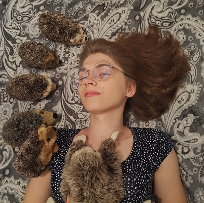
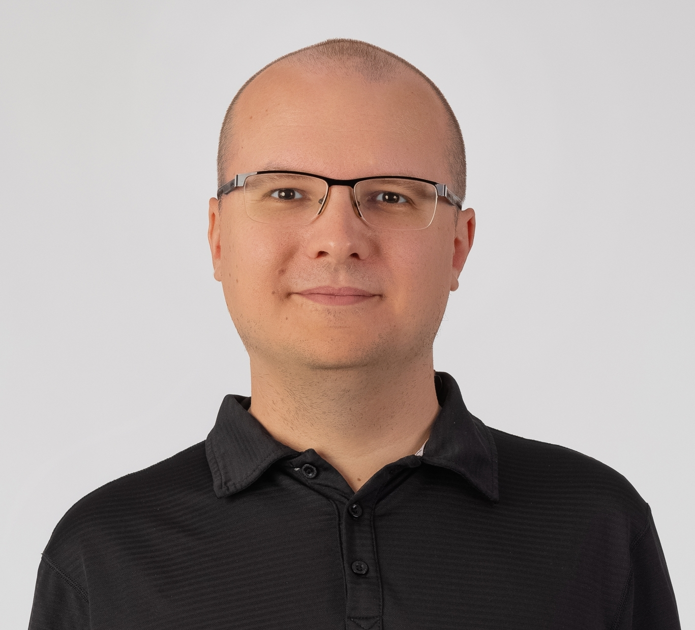
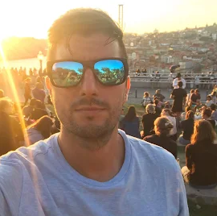
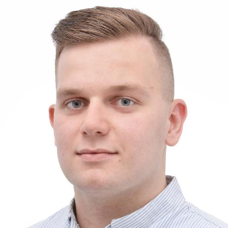
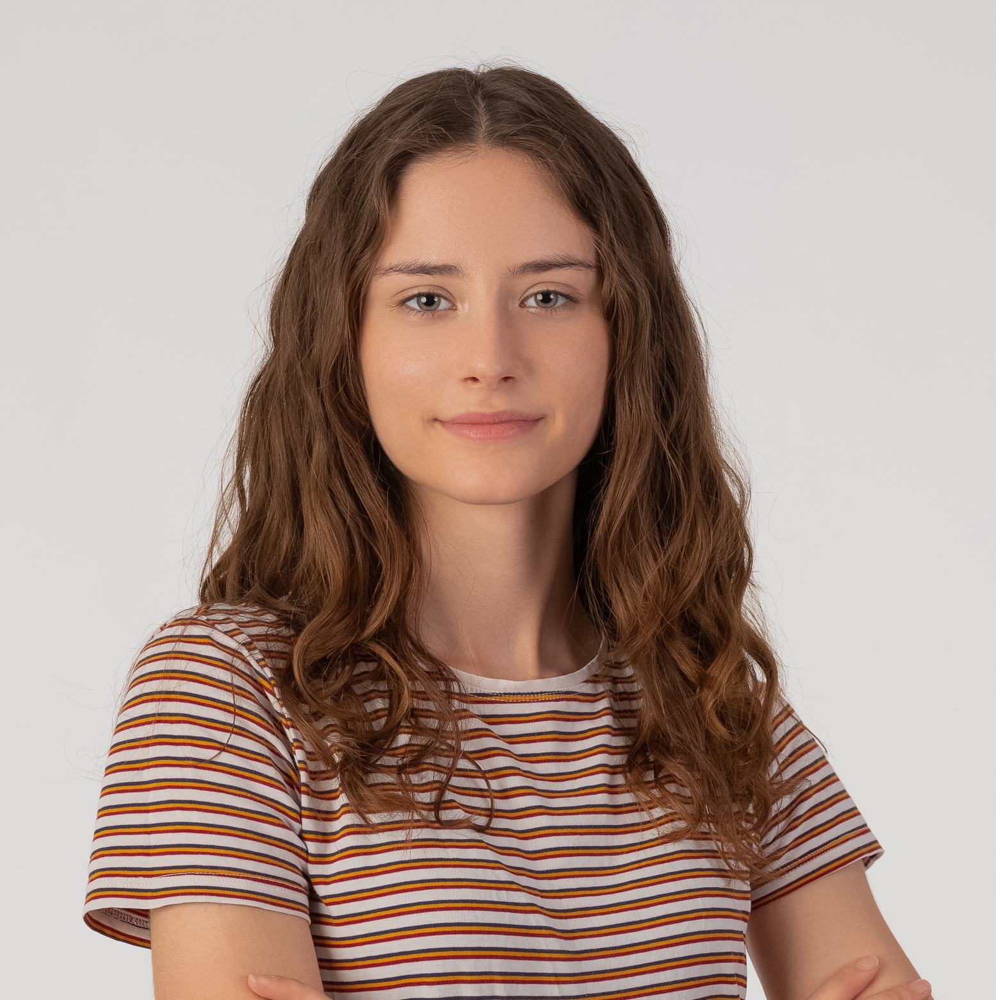
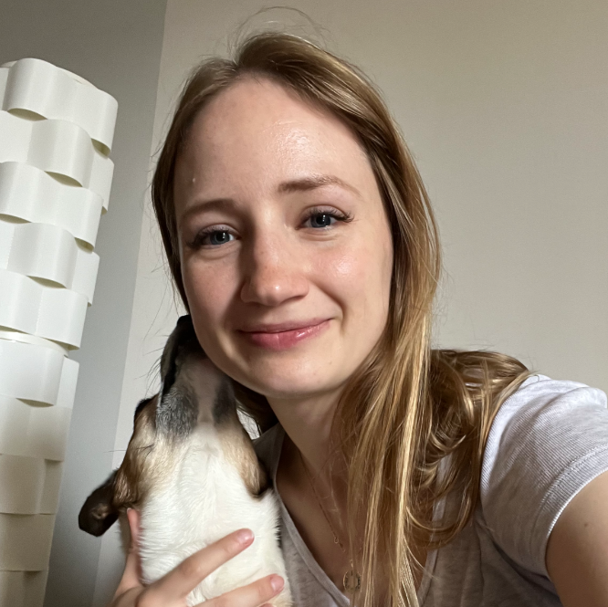
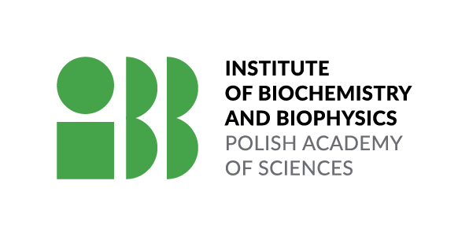
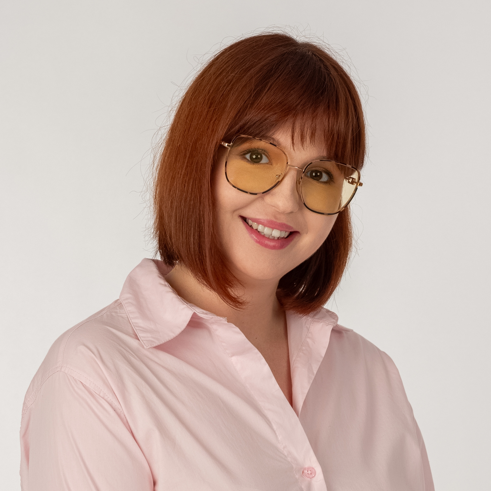
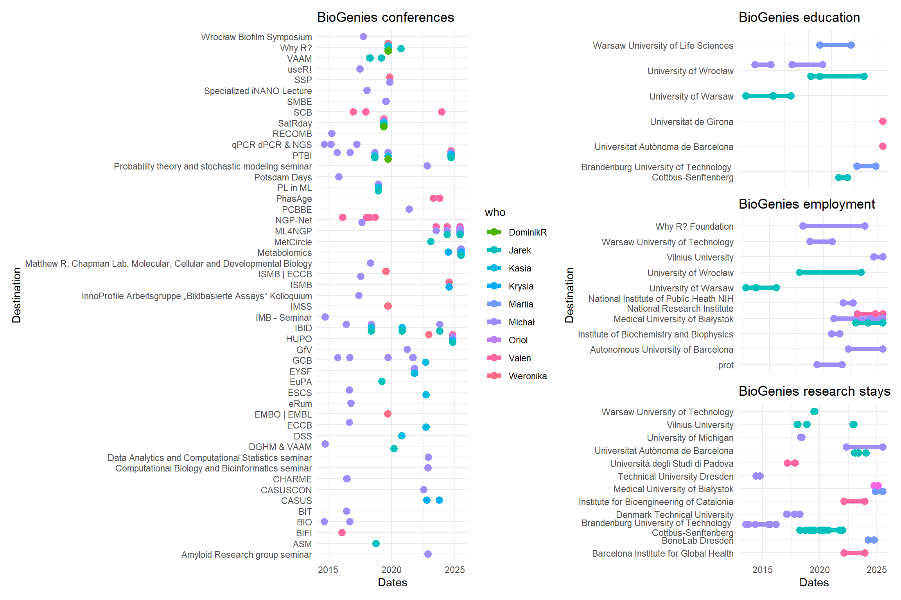
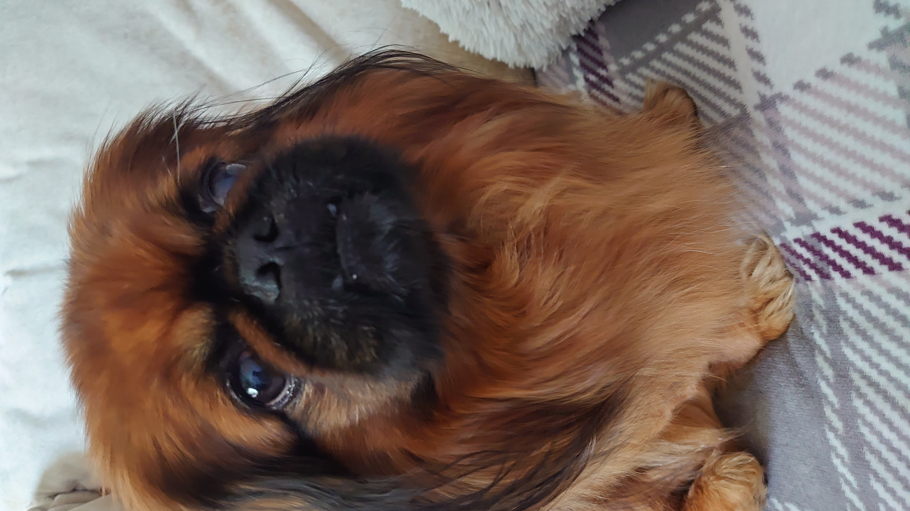

# BioGenies team

### 🥸 BioGenies

Laura Bąkała

Michał Burdukiewicz  

[ Chilimoniuk}")](team/jc.llms.md)

Jarosław (Jarek) Chilimoniuk  

[ Grzesiak with Czarek")](team/kg.llms.md)

Krystyna (Krysia) Grzesiak  

Valentín Iglesias 

Jakub Kołodziejczyk 

Joanna Pokora 

Weronika Puchała 

Mariia Rutkowska 

Damian Wilary 

### 🚀 Our mobility

### 🗺️ Countries visited

### 🐶 Our doggos and cattos 😼

Czarek

Delma

Piksel

Invi

Lusia

Elis
