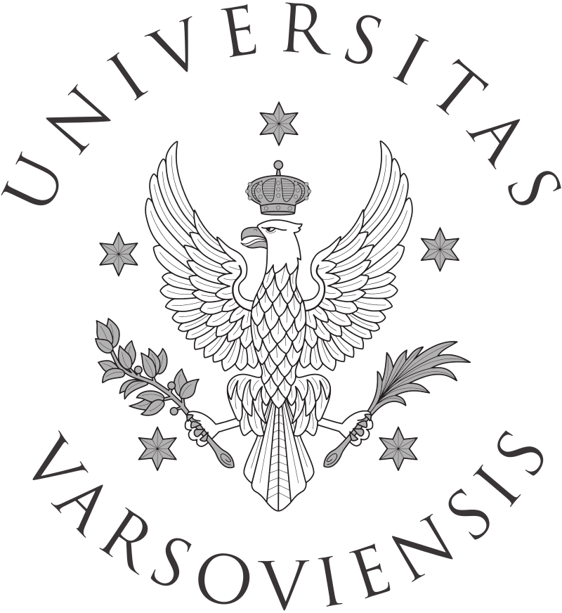

# Jarosław (Jarek) Chilimoniuk

# 📱 **Contact**

------------------------------------------------------------------------

 [![](data:image/svg+xml;base64,PHN2ZyBhcmlhLWhpZGRlbj0idHJ1ZSIgcm9sZT0iaW1nIiB2aWV3Ym94PSIwIDAgNDk2IDUxMiIgc3R5bGU9ImhlaWdodDozZW07d2lkdGg6Mi45MWVtO3ZlcnRpY2FsLWFsaWduOi0wLjEyNWVtO21hcmdpbi1sZWZ0OmF1dG87bWFyZ2luLXJpZ2h0OmF1dG87Zm9udC1zaXplOmluaGVyaXQ7ZmlsbDojMjQyOTJlO292ZXJmbG93OnZpc2libGU7cG9zaXRpb246cmVsYXRpdmU7Ij48cGF0aCBkPSJNMTY1LjkgMzk3LjRjMCAyLTIuMyAzLjYtNS4yIDMuNi0zLjMuMy01LjYtMS4zLTUuNi0zLjYgMC0yIDIuMy0zLjYgNS4yLTMuNiAzLS4zIDUuNiAxLjMgNS42IDMuNnptLTMxLjEtNC41Yy0uNyAyIDEuMyA0LjMgNC4zIDQuOSAyLjYgMSA1LjYgMCA2LjItMnMtMS4zLTQuMy00LjMtNS4yYy0yLjYtLjctNS41LjMtNi4yIDIuM3ptNDQuMi0xLjdjLTIuOS43LTQuOSAyLjYtNC42IDQuOS4zIDIgMi45IDMuMyA1LjkgMi42IDIuOS0uNyA0LjktMi42IDQuNi00LjYtLjMtMS45LTMtMy4yLTUuOS0yLjl6TTI0NC44IDhDMTA2LjEgOCAwIDExMy4zIDAgMjUyYzAgMTEwLjkgNjkuOCAyMDUuOCAxNjkuNSAyMzkuMiAxMi44IDIuMyAxNy4zLTUuNiAxNy4zLTEyLjEgMC02LjItLjMtNDAuNC0uMy02MS40IDAgMC03MCAxNS04NC43LTI5LjggMCAwLTExLjQtMjkuMS0yNy44LTM2LjYgMCAwLTIyLjktMTUuNyAxLjYtMTUuNCAwIDAgMjQuOSAyIDM4LjYgMjUuOCAyMS45IDM4LjYgNTguNiAyNy41IDcyLjkgMjAuOSAyLjMtMTYgOC44LTI3LjEgMTYtMzMuNy01NS45LTYuMi0xMTIuMy0xNC4zLTExMi4zLTExMC41IDAtMjcuNSA3LjYtNDEuMyAyMy42LTU4LjktMi42LTYuNS0xMS4xLTMzLjMgMi42LTY3LjkgMjAuOS02LjUgNjkgMjcgNjkgMjcgMjAtNS42IDQxLjUtOC41IDYyLjgtOC41czQyLjggMi45IDYyLjggOC41YzAgMCA0OC4xLTMzLjYgNjktMjcgMTMuNyAzNC43IDUuMiA2MS40IDIuNiA2Ny45IDE2IDE3LjcgMjUuOCAzMS41IDI1LjggNTguOSAwIDk2LjUtNTguOSAxMDQuMi0xMTQuOCAxMTAuNSA5LjIgNy45IDE3IDIyLjkgMTcgNDYuNCAwIDMzLjctLjMgNzUuNC0uMyA4My42IDAgNi41IDQuNiAxNC40IDE3LjMgMTIuMUM0MjguMiA0NTcuOCA0OTYgMzYyLjkgNDk2IDI1MiA0OTYgMTEzLjMgMzgzLjUgOCAyNDQuOCA4ek05Ny4yIDM1Mi45Yy0xLjMgMS0xIDMuMy43IDUuMiAxLjYgMS42IDMuOSAyLjMgNS4yIDEgMS4zLTEgMS0zLjMtLjctNS4yLTEuNi0xLjYtMy45LTIuMy01LjItMXptLTEwLjgtOC4xYy0uNyAxLjMuMyAyLjkgMi4zIDMuOSAxLjYgMSAzLjYuNyA0LjMtLjcuNy0xLjMtLjMtMi45LTIuMy0zLjktMi0uNi0zLjYtLjMtNC4zLjd6bTMyLjQgMzUuNmMtMS42IDEuMy0xIDQuMyAxLjMgNi4yIDIuMyAyLjMgNS4yIDIuNiA2LjUgMSAxLjMtMS4zLjctNC4zLTEuMy02LjItMi4yLTIuMy01LjItMi42LTYuNS0xem0tMTEuNC0xNC43Yy0xLjYgMS0xLjYgMy42IDAgNS45IDEuNiAyLjMgNC4zIDMuMyA1LjYgMi4zIDEuNi0xLjMgMS42LTMuOSAwLTYuMi0xLjQtMi4zLTQtMy4zLTUuNi0yeiIgLz48L3N2Zz4=)](https://github.com/jarochi)   

# 🚀 **Research stays**

------------------------------------------------------------------------

# 💻🧫 **Experience**

------------------------------------------------------------------------

# 🎓 **Education**

------------------------------------------------------------------------

###  University of Wrocław

#### BioTechNan - Program of Interdisciplinary Environmental PhD Studies KNOW in the area of Biotechnology and Nanotechnology

2018-10-01 - 2023-07-06  
PhD thesis: **Bioinformatic and experimental analyses of bacterial functional amyloids CsgA and CsgB** 📍 Wrocław, Poland

###  Brandenburg University of Technology Cottbus-Senftenberg

#### Exchange studies, German Academic Exchange Service scholarship, Biotechnology

2020-10-01 - 2021-09-30  
📍 Senftenberg, Germany

###  University of Wrocław

#### Molecular Biology

2017-10-01 - 2018-09-30  
📍 Wrocław, Poland

###  University of Warsaw

#### Biotechnology, specialization in Molecular Biology

2013-10-01 - 2015-08-13  
MSc thesis: **Disposal of hardly biodegradable feedstock wastes in methane fermentation process** 📍 Warsaw, Poland

###  University of Warsaw

#### Biotechnology

2010-10-01 - 2013-09-06  
BSc thesis: **Localization of hSUV3 protein and γ-tubulin at different developmental stages of the human umbilical cord blood-derived neural stem cell line (HUCB-NSC)** 📍 Warsaw, Poland

------------------------------------------------------------------------

# 👏🏻 **Conferences, workshops, training schools** 🤝🏻

------------------------------------------------------------------------

# 📖 **Publications**

------------------------------------------------------------------------

# 🧑🏻‍🔬 **Other activities**

------------------------------------------------------------------------

- Association of Wrocław R Users (STWUR) meetings co-organizer - R language workshops
- Co-organizer of WhyR? 2019 Conference in Warsaw
- Co-organizer of WhyR? 2018 Conference in Wrocław
- CEO of PhD Bioinformatics Club at University of Wrocław, 2017-2023
