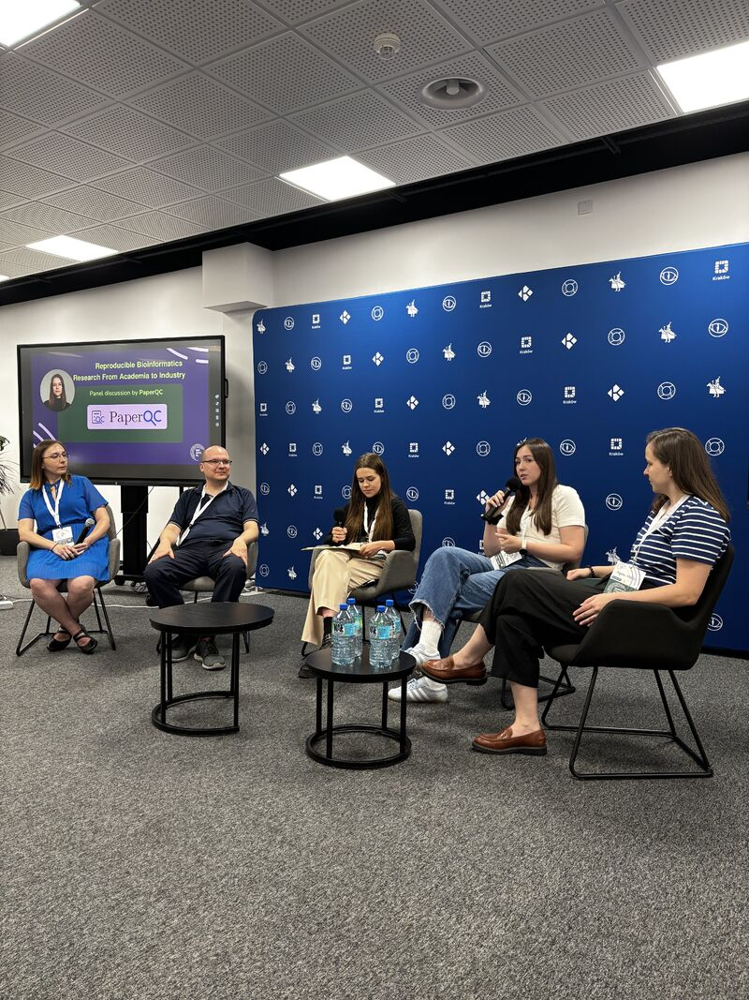

---

**Michał** represented BioGenies at **Bioinformatics Community Meetup #5** in Kraków 🇵🇱, joining the expert panel:

> **“Reproducible Bioinformatics Research: From Academia to Industry”** 💻🔁

The discussion focused on a topic very close to our everyday work: **how to make bioinformatics research actually reproducible**. That means not only producing nice figures and significant *p*-values, but also sharing code and data properly, avoiding statistical and logical pitfalls, and making sure others can really build on the results 🧬📊✅.

Michał joined panelists from academia and industry, bringing his perspective from **Medical University of Białystok and Vilnius University**. The panel also looked at what happens when unreliable research leaves academia and becomes the foundation for real products or analyses, where bad reproducibility can become a much more expensive problem 💸😅.

For BioGenies, this is a particularly relevant topic: with so much of our work involving **machine learning, benchmarking, data analysis and software development**, reproducibility is not an optional extra. It is part of doing the science properly. 

Huge thanks to the Bioinformatics Community PL team for inviting Michał to the discussion! 🤝🚀

