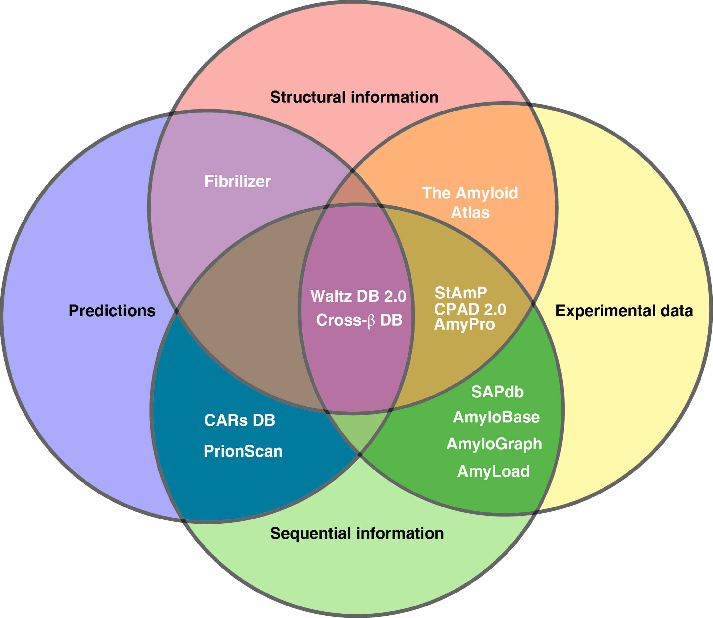

---

📌 **Project highlights**

- 🧬 Comprehensive overview of **amyloid & aggregation databases**  
- 📊 Covers **sequence, structural and interaction resources**  
- 🔗 Highlights **connections between databases and prediction tools**  
- ⚠️ Identifies key **limitations in current resources**  
- 🚀 Provides curated list of databases: [link](https://biogenies.info/amyloid-database-list/)  

{fig-align="center" width='800'}

---

🎉 **New review out!** This one is less about a single tool and more about the **entire ecosystem of amyloid data** 😄  

# 🔗 Explore the resources

- [🌐 Full database list](https://biogenies.info/amyloid-database-list/)  
- [📚 Paper (open access)](https://doi.org/10.1016/j.csbj.2024.10.047)  

👉 This is basically a **map of the amyloid bioinformatics landscape**.

---

# 🎧 Audio summary

Too many databases to remember? Same 😄  

👉 We’ve added a **short audio overview 🎧** so you don’t have to memorize all of them.

<audio controls>
  <source src="../audio/aggregating_resources.m4a" type="audio/x-m4a">
  Your browser does not support the audio element.
</audio>

---

# 🔬 What is this about?

Amyloid aggregation is a **complex, multi-factorial process** involving:

- sequence features  
- 3D structure  
- environmental conditions  

👉 and it underlies:

- neurodegenerative diseases  
- biotechnological challenges  
- functional biological processes  

Because of this complexity:

👉 researchers have built **many specialized databases** to organize experimental knowledge 

---

# 🧠 What we reviewed

We systematically analyzed **amyloid-related databases**, grouping them into:

### 🧬 Sequence-based databases
- focus on **aggregation-prone regions (APRs)**  
- example: AmyLoad, [AmyPro](https://amypro.net/#!/)  

### 🧊 Structure-based databases
- store **3D fibril structures**  
- example: [Amyloid Atlas](https://people.mbi.ucla.edu/sawaya/amyloidatlas/)  

### 🔗 Interaction databases
- capture **cross-interactions between amyloids**  
- example: [AmyloGraph](https://amylograph.com/)  

👉 Each database captures **different aspects of aggregation**.

---

# 📊 Key insight: fragmentation problem

There is no single “perfect” database.

Instead:

- each resource focuses on a **specific niche**  
- data formats and annotations differ  
- integration is difficult  

👉 Result:

❌ no unified benchmark dataset  
❌ hard to compare prediction tools  
❌ fragmented knowledge  

---

# ⚙️ Databases ↔ prediction tools (the feedback loop)

One of the most important conclusions:

👉 databases and prediction tools **co-evolve**

- experimental datasets → enable model development  
- prediction tools → generate new hypotheses  
- new experiments → expand databases  

👉 A **continuous feedback loop** driving the field forward.

---

# 🧬 Examples of this interplay

- AmyloGraph → enabled **PACT / AmyloComp** (cross-interactions)  
- AmyloBase → contributed to **AGGRESCAN**  
- Waltz datasets → led to **WALTZ algorithm**  

👉 Data → model → better data → better model  

---

# ⚠️ Key limitations (important!)

Across databases:

- 🔍 limited search & filtering  
- 📤 poor export options  
- 🧾 incomplete metadata  
- 🤖 reliance on predictions (with biases)  

👉 And most importantly: **aggregation is not only sequence-dependent**

Environmental factors matter:

- pH  
- temperature  
- concentration  
- cofactors  

---

# 🚀 Why this matters

This review shows:

👉 we have **a lot of data**  
👉 but not yet **fully integrated knowledge**

Future directions:

- better **standardization (e.g. MIRRAGGE)**  
- integration of datasets  
- ML models using **multi-dimensional data**  

::: {.content-visible when-format="llms-txt"}

# 📌 Publication metadata

- **Title:** Aggregating amyloid resources: A comprehensive review of databases on amyloid-like aggregation  
- **Journal:** Computational and Structural Biotechnology Journal  
- **Year:** 2024  
- **DOI:** https://doi.org/10.1016/j.csbj.2024.10.047  
- **Authors:** Valentín Iglesias, Jarosław Chilimoniuk, Carlos Pintado-Grima, Oriol Bárcenas, Salvador Ventura, Michał Burdukiewicz  
- **Type:** Review  
- **Domain:** protein aggregation / bioinformatics  
- **Focus:** databases, resources, data integration  

---

# 🏷️ Keywords

amyloids, protein aggregation, databases, bioinformatics, amyloid prediction, aggregation-prone regions, protein misfolding, data integration

::: 
