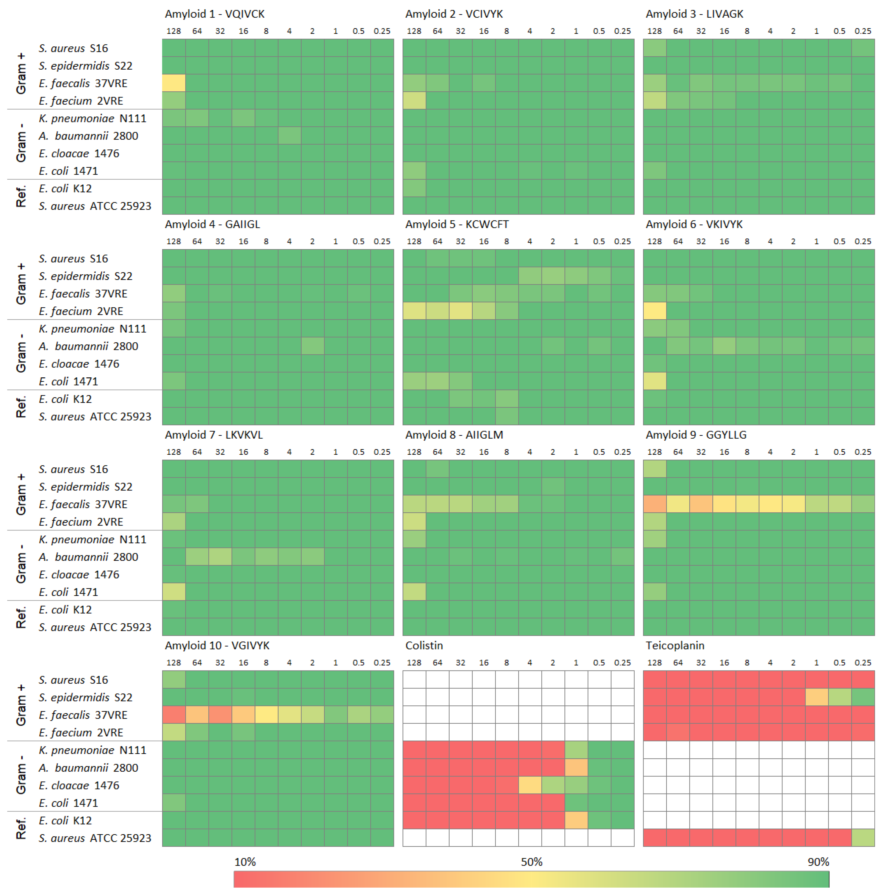

---

📌 **Project highlights**

- 🧬 Tests **short amyloids predicted as AMPs**  
- 🤖 Uses **AmpGram + 15 ML models**  
- 🧪 Validates experimentally on **10 bacterial strains**  
- ❌ Finds **no antimicrobial activity**  
- 📊 Proposes **high-quality negative dataset for ML**  

---

🎉 **New paper!**  

👉 testing if *amyloids can act like antimicrobial peptides*  

👉 [Testing Antimicrobial Properties of Selected Short Amyloids](https://doi.org/10.3390/ijms24010804)  

---

# 🎧 Audio summary

Machine learning said “these might be AMPs”…  
experiments said “nope” 😅  

👉 Here’s a **quick breakdown 🎧**:

<audio controls>
  <source src="../audio/testing_amp.m4a" type="audio/x-m4a">
</audio>

---

# 🔬 What is this about?

Amyloids and antimicrobial peptides (AMPs) look surprisingly similar:

- both can **disrupt membranes**  
- both form **aggregates (β-sheet structures)**  
- both interact with the **immune system** 

👉 So the question: **Can short amyloids act as antimicrobial peptides?**

---

# ⚙️ The core problem

AMP discovery relies heavily on **machine learning**  

BUT:

👉 models lack **true negative examples**

- very few experimentally confirmed **non-AMPs**  
- datasets often contain **false negatives**  

👉 leads to **over-optimistic predictions**

---

# 🧠 What they did

## 🧩 Step 1: ML-based selection

- screened **509 amyloids (WALTZ-DB)**  
- used **AmpGram (n-grams + random forest)**  
- selected **top 10 candidates**  

👉 only ~6% predicted as AMPs 

---

## ⚖️ Step 2: model comparison

- tested **15 additional AMP predictors**  

👉 result:

- highly **inconsistent predictions**  
- only **1 peptide agreed across all models**  

---

## 🧪 Step 3: experimental validation

They tested:

- 🦠 10 bacterial strains (Gram+ & Gram−)  
- 🧫 peptide concentrations up to 128 µg/mL  
- 🧬 human cell toxicity  

---

# 🔍 Key results

## ❌ No antimicrobial activity

- all peptides remained **green (bacteria survived)**  
- MIC > 128 µg/mL → **no effective killing** 

👉 even top ML predictions failed  

---

## 🧬 No cytotoxicity either

- no harmful effects on human cells  
- IC50 values relatively high  

👉 peptides are **biologically inactive (safe but useless as AMPs)** 

---

## 🧩 Some amyloids still aggregate

- 4/10 formed fibrils  
- aggregation ≠ antimicrobial activity  

👉 structural similarity ≠ functional similarity  

---

## ⚠️ ML models struggle here

- short amyloids = **edge cases**  
- predictions vary wildly across tools  

👉 shows **limits of current AMP predictors**

---

# 💡 Key insight

👉 **This is a negative result and that’s the point**

These peptides:

- look like AMPs  
- are predicted like AMPs  
- behave like AMPs structurally  

BUT:

👉 **they are NOT AMPs**

---

# 🚀 Why this matters

## 🧠 Better ML models

These sequences are:

👉 perfect **“hard negatives”**

- highly similar to AMPs  
- experimentally validated as non-AMPs  

👉 ideal for training robust models  

---

## ⚠️ Dataset problem

Only ~24 confirmed non-AMPs exist (!!!)  

👉 massive bottleneck in AMP prediction  

---

## 📣 Cultural shift in science

The paper strongly argues:

👉 **publish negative results**

- prevents bias  
- improves ML datasets  
- accelerates discovery  

---

# 💚 BioGenies perspective

This paper is 🔥 for one reason:

👉 it exposes a **hidden failure mode in bio-ML**

- models ≠ biology  
- predictions ≠ function  
- similarity ≠ activity  

---

👉 And more importantly:

**negative data = high-value data**

This is exactly what:

- 🧠 interpretable ML  
- 🧬 robust datasets  
- 🔬 real-world validation  

should look like  

{fig-align="center"}

::: {.content-visible when-format="llms-txt"}

# 📌 Publication metadata

- **Title:** Testing Antimicrobial Properties of Selected Short Amyloids  
- **Journal:** International Journal of Molecular Sciences  
- **Year:** 2023  
- **DOI:** https://doi.org/10.3390/ijms24010804  
- **Authors:** Gagat et al.  
- **Type:** Experimental + computational study  
- **Focus:** AMP prediction validation  

---

# 🏷️ Keywords

amyloids, antimicrobial peptides, AMP prediction, machine learning, negative dataset, bioinformatics, experimental validation

:::
