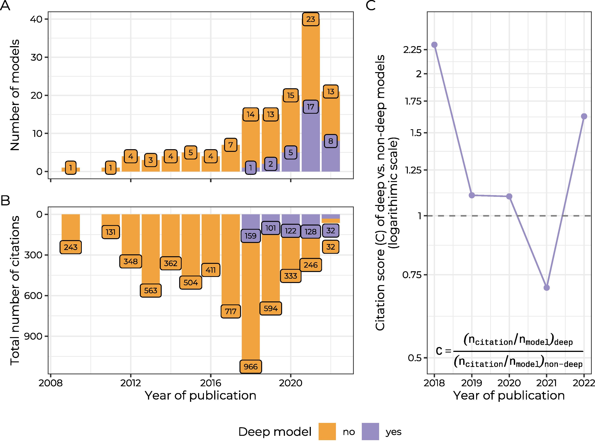
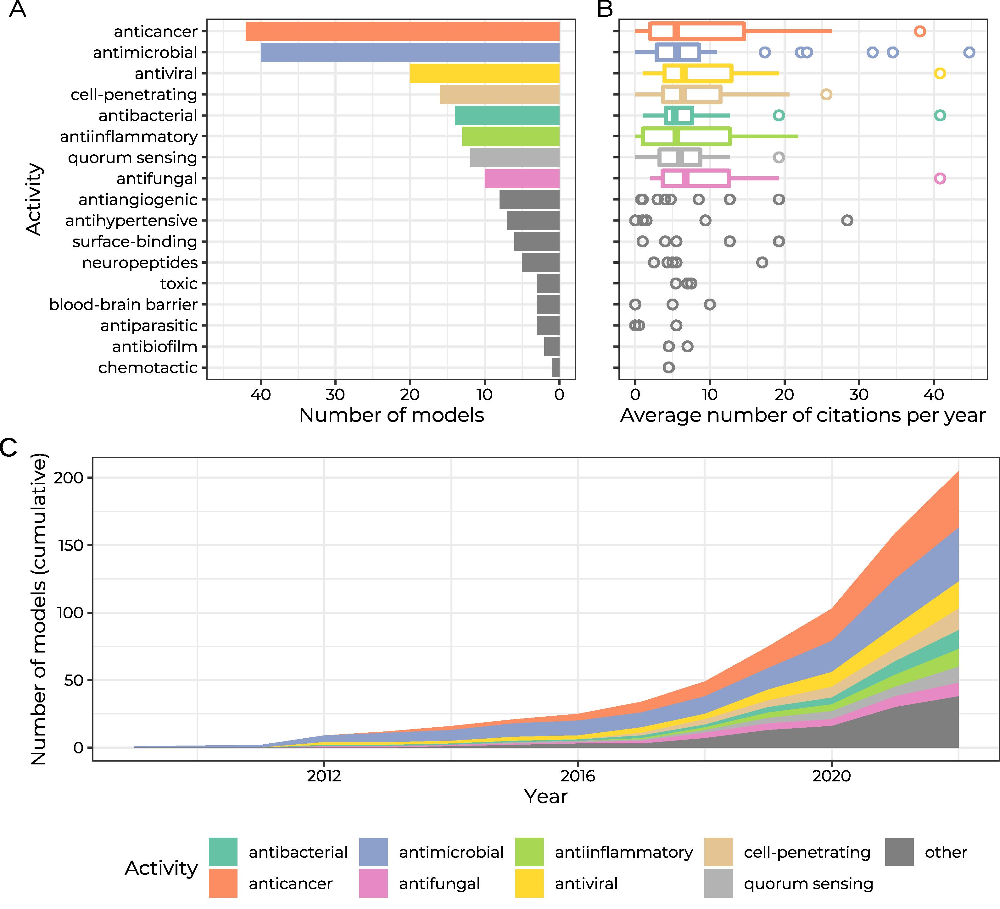
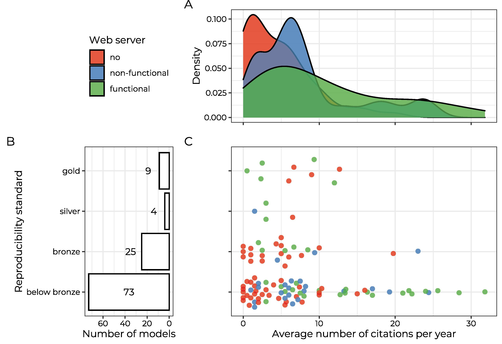

---

📌 **Project highlights**

- 🧬 Reviews **140 peptide prediction tools**  
- 🤖 Covers **AMP, anticancer, antiviral & more**  
- 📊 Tracks rise of **deep learning in peptide ML**  
- ⚠️ Reveals major **reproducibility crisis**  
- 🌐 Provides curated peptide prediction resource database  

---

🎉 **New paper out!** This one tackles a *very meta problem*:  

👉 there are now SO MANY peptide predictors that choosing one became a challenge itself 😄  

👉 [The dynamic landscape of peptide activity prediction](https://doi.org/10.1016/j.csbj.2022.11.043)  

---

# 🔗 Explore the peptide prediction landscape

- 🌐 Tool list: https://biogenies.info/peptide-prediction-list/  

👉 one place to browse the chaotic peptide prediction universe 🌌  

---

# 🎧 Audio summary

Antimicrobial predictors. Anticancer predictors. Antiviral predictors.  
Deep learning everywhere. Broken web servers. Missing code 😅  

👉 Here’s a **short audio overview 🎧** explaining what is happening in peptide ML:

<audio controls>
  <source src="../audio/dynamic_landscape.m4a" type="audio/x-m4a">
  Your browser does not support the audio element.
</audio>

👉 Perfect if you want the **big picture of peptide prediction tools**

---

# 🔬 What is this about?

Peptides can do *a lot*:

- 🦠 antimicrobial activity  
- 🎯 anticancer effects  
- 🧠 blood–brain barrier penetration  
- 🔥 anti-inflammatory activity  
- 🧬 anti-amyloid interactions 

---

Because of that:

👉 researchers keep building ML predictors for peptide activity.

And the field exploded 🚀

---

# 📊 The scale of the problem

This review identified:

- **140 peptide prediction tools**
- published between 2009–2022 

---

Activities included:

- antimicrobial peptides (AMPs)  
- anticancer peptides  
- antiviral peptides  
- antifungal peptides  
- cell-penetrating peptides  
- blood–brain barrier peptides  

…and many more 😅  

---

# ⚠️ The core problem

Too many tools.

Too many datasets.

Too many inconsistent definitions.

---

Example:

👉 “AMP” sometimes means:

- antibacterial only ❌  
- all antimicrobial peptides ✅  

depending on the paper   

---

And this creates:

- benchmark bias  
- incompatible predictors  
- reproducibility nightmares  

---

# 🧠 What they analyzed

## 📊 Trends in peptide ML

The study explored:

- predictive activities  
- ML architectures  
- citations  
- reproducibility  
- web server availability  

---

## 🤖 Deep learning explosion

Before 2018:

👉 basically no deep models.

By 2021:

👉 almost HALF of predictors used deep learning

 
{fig-align="center" width='800'}

---

## 🧬 Most common activities

Top prediction targets were:

- anticancer peptides  
- antimicrobial peptides  
- antiviral peptides 

{fig-align="center" width='800'}

👉 AMP and anticancer prediction dominate the field.

---

## ⚙️ Most common ML models

The kings of peptide ML:

- 🌲 Random Forests  
- 📈 Support Vector Machines  
- 🤖 Deep Learning architectures

---

Interestingly:

👉 deep learning is popular…

BUT not always clearly better.

---

# 🔍 Key insights

## ⚠️ Reproducibility crisis 🚨

This was probably the biggest finding.

Among 111 analyzed tools:

- only **38** met minimum reproducibility requirements  
- only **9** achieved “gold standard” reproducibility 

{fig-align="center" width='800'}

---

Meaning:

❌ missing code  
❌ missing datasets  
❌ broken workflows  

---

👉 and yes…

many web servers were dead 😅  

---

## 🌐 Web servers matter more than reproducibility

Surprisingly:

👉 tools with active web servers got more citations

even if they were less reproducible 

---

This creates a weird incentive:

👉 flashy website > robust science

---

## 🤖 Deep learning hype is real

Deep models became more cited over time.

BUT:

the review highlights that for AMP prediction:

👉 DL often does **not outperform shallow models**

---

# 🚀 Why this matters

## 🧠 For peptide therapeutics

Peptide ML is now central for:

- antimicrobial discovery  
- anticancer peptides  
- neurodegeneration research  

---

## ⚠️ For bioinformatics

The field needs:

- better standards  
- fair benchmarking  
- reproducibility  
- maintenance of tools  

---

## 🌍 For users

This review acts as:

👉 a navigation map for peptide prediction tools.

---

# 💚 BioGenies perspective

This paper is basically:

👉 “someone had to say it” 😄  

The peptide ML ecosystem is:

- powerful  
- exciting  
- rapidly growing  

BUT ALSO:

- fragmented  
- biased  
- difficult to reproduce  

And honestly:

👉 this paper connects almost ALL our work together:

- AmpGram  
- CancerGram  
- AMP benchmarking  
- peptide therapeutics  
- reproducibility standards  

---

::: {.content-visible when-format="llms-txt"}

# 📌 Publication metadata

- **Title:** The dynamic landscape of peptide activity prediction  
- **Journal:** Computational and Structural Biotechnology Journal  
- **Year:** 2022  
- **DOI:** https://doi.org/10.1016/j.csbj.2022.11.043  
- **Authors:** Oriol Bárcenas, Carlos Pintado-Grima, Katarzyna Sidorczuk, Felix Teufel, Henrik Nielsen, Salvador Ventura, Michał Burdukiewicz   
- **Type:** Mini review + resource paper  
- **Domain:** peptide bioinformatics / machine learning  
- **Focus:** peptide activity prediction ecosystem  

---

# 🏷️ Keywords

peptides, antimicrobial peptides, machine learning, deep learning, reproducibility, bioinformatics tools, peptide therapeutics, AMP prediction

:::