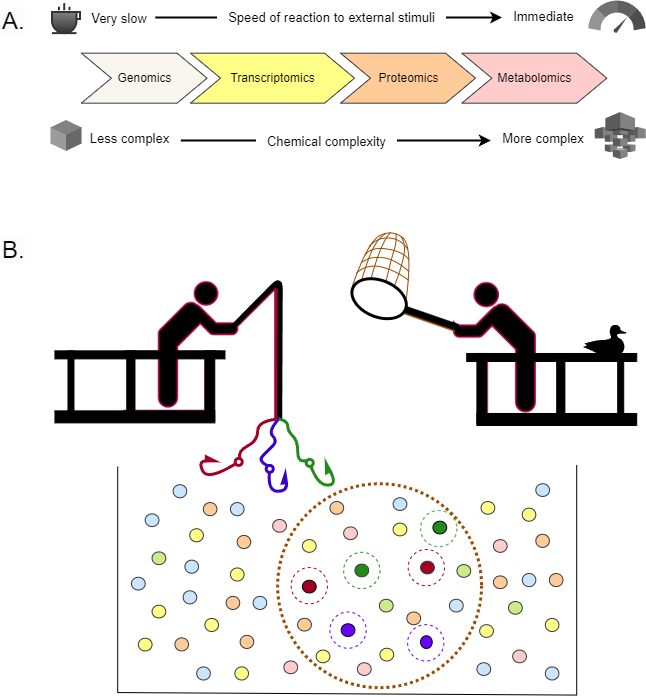

---

📌 **Project highlights**

- 🧠 Machine learning for **clinical decision support systems (CDSS)**  
- 🧬 Focus on **metabolomics data complexity**  
- ⚙️ Covers full pipeline: data → models → clinical utility  
- ⚠️ Critical discussion of **limitations & risks**  
- 🚀 Outlook on **precision medicine applications**  

---

🎉 **New review out!** This one sits at the intersection of **AI, metabolomics and clinical practice**  

# 🔗 Explore the paper

- [📚 Paper (TRAC)](https://doi.org/10.1016/j.trac.2024.117819) or [pdf](../download_files/ML-based trac.pdf) 

👉 A deep dive into how **machine learning turns metabolomics into clinical decisions**.

---

# 🎧 Audio summary

Not everyone wants to dive straight into **ML, metabolomics, and clinical pipelines** (fair 😄)  

👉 Here’s a **short audio walkthrough 🎧** explaining what this work is about and why it matters:

<audio controls>
  <source src="../audio/ml-based.m4a" type="audio/x-m4a">
  Your browser does not support the audio element.
</audio>

👉 Perfect if you want the **big picture without the technical overload**.

---

# 🔬 What is this about?

Modern medicine generates **massive, multi-layered datasets**.  

Among them:

👉 **metabolomics** captures the *current physiological state* of a patient  

- fast response to environmental changes  
- extremely high chemical diversity  
- thousands of measurable molecules 

But this comes at a cost:

❗ extreme complexity → requires machine learning  

---

# 🧠 Enter: Clinical Decision Support Systems (CDSS)

ML-based CDSS aim to:

- diagnose diseases  
- predict outcomes  
- guide treatment decisions  

👉 essentially **simulate clinical reasoning using data**  

Typical pipeline:

1. 🧪 Sample collection (blood, urine, tissue)  
2. 🔬 MS / NMR → metabolite profiles  
3. 📊 Data processing  
4. 🤖 ML model → prediction  

📊 The *diagram on page 3* shows this full workflow clearly:

- raw spectra → metabolites → clinical data → predictive model  

---

# ⚙️ Machine learning in metabolomics

Three main paradigms:

### 🔍 Unsupervised learning
- clustering patients/metabolites  
- dimensionality reduction (PCA, etc.)

### 🎯 Supervised learning
- classification (disease vs control)  
- regression (risk prediction)

### ⏳ Specialized models
- survival analysis  
- time-to-event predictions  

👉 ML is already deeply embedded, even in **metabolite identification pipelines**. 

---

# ⚠️ Core challenge: the data itself

Metabolomics is… messy.

## 1. Curse of dimensionality
- thousands of metabolites  
- few samples (“p ≫ n”)  
- risk of overfitting  

## 2. Noise & artifacts
- MS produces **thousands of signals**  
- many are:
  - background noise  
  - adducts / fragments  
  - misannotations  

👉 can completely distort ML models  

## 3. Missing values
- technical + biological causes  
- require complex imputation strategies  

---

# 🧬 Feature selection & engineering

To survive this complexity, models rely on:

### ✂️ Feature selection
- filter (statistics)  
- wrapper (model-based)  
- embedded (e.g., LASSO, RF)

### 🔄 Feature engineering
- normalization  
- scaling  
- pathway-based aggregation  

👉 This step is **absolutely critical** for model performance  

---

# 📊 Clinical evaluation ≠ ML accuracy

This is one of the most important points.

👉 High accuracy ≠ clinical usefulness  

Instead, models must optimize:

- sensitivity / specificity  
- false positives vs false negatives  
- clinical utility metrics (NB, NNB)  

👉 because wrong predictions have **real consequences**  

---

# 🧠 Explainability problem

Many models are:

❌ black boxes  

This is unacceptable in medicine.

👉 Enter **XAI (Explainable AI)**  
- helps understand decisions  
- validates biological plausibility  
- builds trust  

---

# 🔗 Pathway analysis as validation

A really nice idea in this paper:

👉 use pathway analysis as an **independent check**

- confirms biological relevance  
- links metabolites → mechanisms  

Example:

- Parkinson’s biomarkers  
- validated via pathway links to α-synuclein aggregation 

---

# 🚨 Reality check: current limitations

Despite hype, major issues remain:

- ❌ lack of external validation  
- ❌ small, biased datasets  
- ❌ poor reproducibility  
- ❌ limited interpretability  

👉 many models are **not clinically ready yet** 

---

# 🧠 Deeper problem: causality

ML finds patterns—but:

👉 **correlation ≠ causation**

To personalize treatment, we need:

- causal inference  
- mechanistic understanding  
- integration with biology  

---

# 🚀 Why this matters

This review makes one thing clear:

👉 metabolomics + ML is powerful  
👉 but not plug-and-play  

Future progress depends on:

- better data quality  
- standardized pipelines  
- integration with clinical data  
- rigorous validation  

---

# 💚 BioGenies perspective

This fits perfectly with what we care about:

- data quality 🧪  
- model interpretability 🧠  
- biological grounding 🔬  

👉 because **good models need good biology—not just good ML**

{fig-align="center" width='800'}

::: {.content-visible when-format="llms-txt"}

# 📌 Publication metadata

- **Title:** ML-based clinical decision support models based on metabolomics data  
- **Journal:** Trends in Analytical Chemistry  
- **Year:** 2024  
- **DOI:** https://doi.org/10.1016/j.trac.2024.117819  
- **Authors:** Michał Burdukiewicz, Jarosław Chilimoniuk, Krystyna Grzesiak, Adam Krętowski, Michał Ciborowski :contentReference[oaicite:7]{index=7}  
- **Type:** Review  
- **Focus:** ML, metabolomics, clinical decision systems  

---

# 🏷️ Keywords

metabolomics, machine learning, clinical decision support, CDSS, biomarkers, precision medicine, AI, pathway analysis, explainable AI

:::

