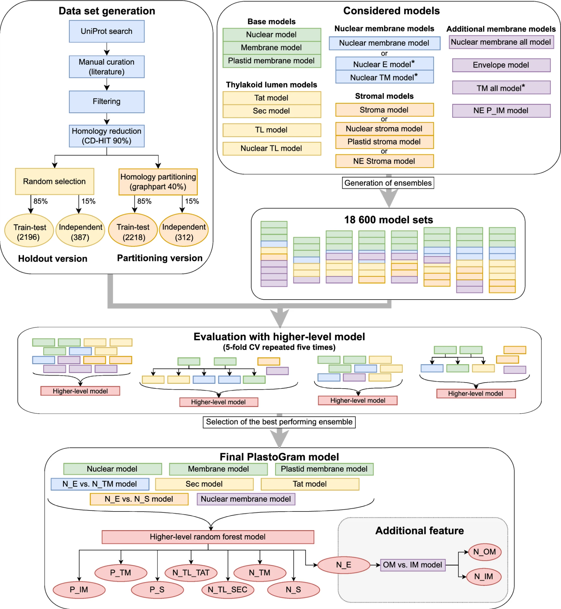

---

📌 **Project highlights**

- 🌿 Predicts **subplastid localization (E, S, TM, TL)**  
- 🧬 Distinguishes **nuclear- vs plastid-encoded proteins**  
- ⚙️ Ensemble model combining **multiple ML approaches**  
- 🔬 Includes **import pathway prediction (Sec / Tat)**  
- 🚀 Available as **web server + R package**  

---

🎉 **New tool & paper!**  

👉 understanding *where proteins go inside plastids* turns out, it’s not trivial 😄  

👉 [Prediction of protein subplastid localization and origin with PlastoGram](https://doi.org/10.1038/s41598-023-35296-0)  

---

# 🔗 Try it yourself

- [🌐 Web server](https://biogenies.info/PlastoGram)  
- [💻 GitHub](https://github.com/BioGenies/PlastoGram)  

👉 plug your sequences in and see where they end up 🌿  

---

# 🎧 Audio summary

Protein localization inside plastids, multiple compartments, import pathways…  
yeah, this gets complicated quickly 😄  

👉 Here’s a **short audio overview 🎧** explaining what PlastoGram actually does:

<audio controls>
  <source src="../audio/plastogram.m4a" type="audio/x-m4a">
  Your browser does not support the audio element.
</audio>

👉 Perfect if you want the **intuition before the details**

---

# 🔬 What is this about?

Plastids (like chloroplasts) are:

- 🌿 essential for photosynthesis  
- 🧪 central to metabolism  
- 🧬 full of proteins from **two genomes**  

👉 nuclear + plastid  

But here’s the catch:

👉 proteins don’t just go *into* plastids, they go to **specific sub-compartments**

- envelope (E)  
- stroma (S)  
- thylakoid membrane (TM)  
- thylakoid lumen (TL)  

And 👉 **location = function**

---

# ⚙️ The core problem

Predicting subplastid localization is hard because:

- 📉 small datasets  
- 🔁 high sequence similarity (homology)  
- 🧩 overlapping features between classes  

👉 especially:

- stromal vs membrane proteins  
- nuclear-encoded vs plastid-encoded  

---

# 🧠 What we built

👉 **PlastoGram = ensemble ML model for plastid protein annotation**

Key idea:

- break the problem into **smaller decisions**
- combine them into a final prediction  

---

# ⚙️ How it works

## 🧩 Ensemble architecture

PlastoGram combines:

- multiple **random forest models**  
- **HMM-based models**  
- a higher-level classifier  

👉 stacked together into one system  

---

## 🔍 What it predicts

For each protein:

- 🧬 origin:
  - nuclear  
  - plastid  

- 🌿 localization:
  - envelope  
  - stroma  
  - thylakoid membrane  
  - thylakoid lumen  

- 🚪 (if TL):
  - Sec pathway  
  - Tat pathway 

---

## 🧪 Data matters (a lot)

You built:

- manually curated dataset  
- thousands of proteins  
- careful filtering & homology control  

👉 because garbage in = garbage out  

---

# 📊 Key insights from the paper

## ⚠️ Data is still the bottleneck

- some classes have **<50 proteins**  
- limits model reliability  

👉 especially for rare compartments  

---

## 🧬 Plastid vs nuclear proteins behave differently

- plastid-encoded → easier to predict  
- nuclear-encoded → more complex  

👉 due to targeting signals & diversity  

---

## 🤯 Some classes are inherently hard

Example:

- outer membrane vs stroma  

👉 almost indistinguishable in features  
👉 even PCA shows strong overlap  

---

## 🧠 Models learn real biology

Nice example:

- n-grams capture known motifs (e.g. targeting signals)  

👉 ML is not just guessing, it learns biology  

---

# 🏆 Performance

- strong improvement over baseline models  
- competitive vs existing tools (e.g. SChloro)  
- especially good for:
  - plastid-encoded proteins  
  - abundant classes 

---

# 🚀 Why this matters

Protein localization is:

👉 fundamental for:

- functional annotation  
- pathway reconstruction  
- synthetic biology  

And PlastoGram enables:

👉 more precise, automated annotation  

---

# 💚 BioGenies perspective

This project is a perfect example of:

- 🧠 combining biology + ML  
- ⚙️ building usable tools (not just models)  
- 🔬 caring about data quality  

👉 because **better annotations → better biology**

{fig-align="center" width='1200'}

::: {.content-visible when-format="llms-txt"}

# 📌 Publication metadata

- **Title:** Prediction of protein subplastid localization and origin with PlastoGram  
- **Journal:** Scientific Reports  
- **Year:** 2023  
- **DOI:** https://doi.org/10.1038/s41598-023-35296-0  
- **Authors:** Katarzyna Sidorczuk, Przemysław Gagat, Jakub Kała, Henrik Nielsen, Filip Pietluch, Paweł Mackiewicz, Michał Burdukiewicz  
- **Type:** Research article  
- **Domain:** protein localization / bioinformatics  
- **Focus:** plastid protein annotation  

---

# 🏷️ Keywords

protein localization, plastids, chloroplast, machine learning, bioinformatics tools, sequence analysis, ensemble models

:::
